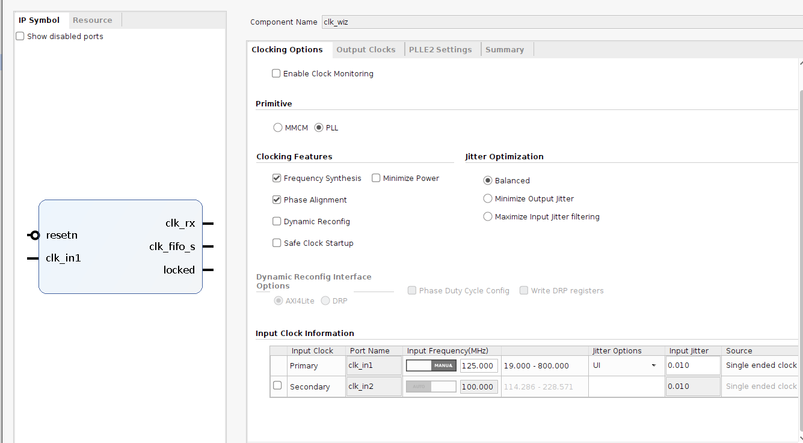
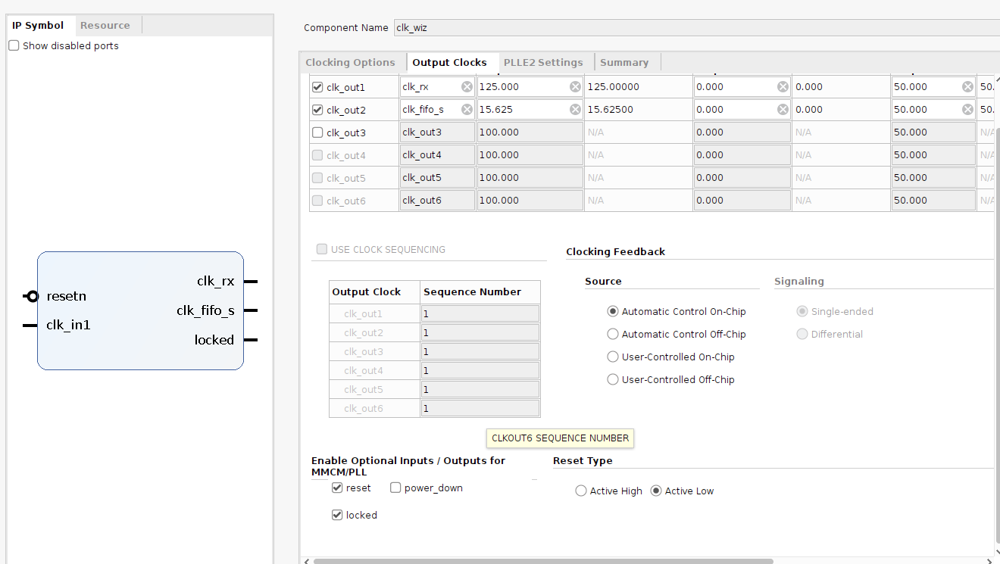
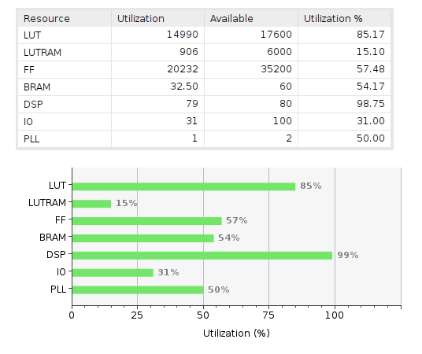
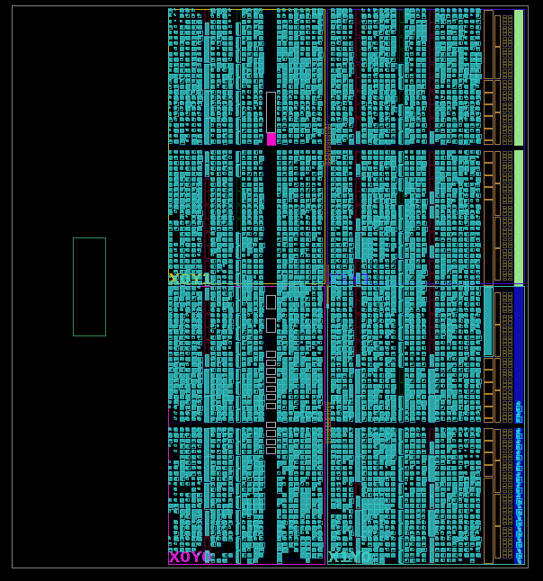

# Receiver

Documento que indica todo lo necesario para usar el receptor **IEEE_8021513_RX**.

El IP Core se encuentra en esta carpeta: [IP Core Rx](https://github.com/vlc-utn/dc-ofdm/tree/main/Docs/ip_cores).

El proyecto ejemplo de Vivado donde se corrió la simulación: [Ejemplo Rx](https://github.com/vlc-utn/dc-ofdm/tree/main/vivado/red_pitaya_rx).

## Funcionalidades probadas

* Máximo tamaño de trama recibida: 4096 bytes.

* Acepta la recepción de múltiples tramas consecutivas, sin necesidad de reset.

* Señal de entrada mínima: [-0.1; 0.1]. Señal de entrada máxima: [-1.0; 1.0].

* Máximo error de frecuencia entre el clock del transmisor y el receptor: 15 kHz.

* Delay aleatorio entre señal recibida y transmitida.

## Clocks

* **clk_adc**: [125 MHz]. Clock físico del ADC, conectado a la entrada del clocking wizard.

* **clk_rx**: [125 MHz]. Clock del receptor, salida del clocking wizard. Sincrónico con la entrada del receptor.

* **clk_fifo_s**: [15.625 MHz]. Clock para sacar datos de la FIFO, salida del clocking wizard. Sincrónico con la salida del receptor.

## Inputs

* **IPCORE_CLK**: [clk]. Señal de clock de 125 MHz.

* **IPCORE_RESETN**: [bool]. Señal de reset ACTIVE LOW ('0' para resetear).

* **data_in**: [fixdt(1,16,15)]. Datos de entrada del ADC. Los dos bits LSB son descartados.

## Outputs

* **data_out**: [uint8_t]. Palabras recibidas del payload. Solamente se reciben las palabras "efectivas". Recuerde que para el transmisor, se transmitían palabras extras para llenar el mútliplo de 21. Esas palabras extras son descartadas automáticamente por el receptor.

* **valid_out**: [bool]. Vale "1" mientras las palabras del payload sean válidas. Señal de AXI4-Stream.

* **start_out**: [bool]. Vale "1" mientras sea válida la primera palabra del payload.

* **end_out**: [bool]. Vale "1" mientras sea válida la última palabra del payload, indicando el final de la recepción.

* **[reg0, reg1, reg2, reg3]**: [uint32_t]. Registros leídos del encabezado. Su valor es válido luego de haber recibido la señal de `header_ready`.

* **header_ready**: [bool]. Vale "1" una vez que fueron leídos los registros del encabezado, indicando que se detectó una nueva transmisión.

* **header_error**: [bool]. Si pone en "1" durante el mismo ciclo de clock que `header_ready`, e indica que falló el CRC del encabezado, por lo que los datos leídos del payload deben ser ignorados.

## Modo de funcionamiento

1. Se reciben continuamente datos del DAC.

2. Luego de que se haya detectado el preámbulo OFDM de un mensaje, el receptor seguirá trabajando para demodular el encabezado. Una vez que el encabezado haya sido leído, se pondrá en "" la señal `header_ready`, y se actualizarán los valores de los cuatro registros. En caso de que haya habido un error en la decodificación, se levantará la señal `header_error`.

3. Pasado un tiempo, se levantará la señal `start_out`, indicando que están llegando las primeros bytes del payload a la FIFO. Consecuentemente, se irán escribiendo de manera intermitente las palabras del payload, levantado la señal de `valid_out` cuando haya palabras válidas.

4. Una vez que se termina de recibir el payload, se levanta la señal `end_out` durante la última palabra. Esta señal es equivalente a un TLAST de AXI4-Stream, si se desea usar.

## Block design

## Simulation

Critical warnings: 0.

## Sintesis

Nota: recordar incluir el archivo de constraints `ieee_constraints_rx.xdc`, que se encuentra dentro de la carpeta del IP_CORE.

Critical warnings: 0.

## Implementation

## Versionado

### v1.0

* Emisión inicial del documento.
