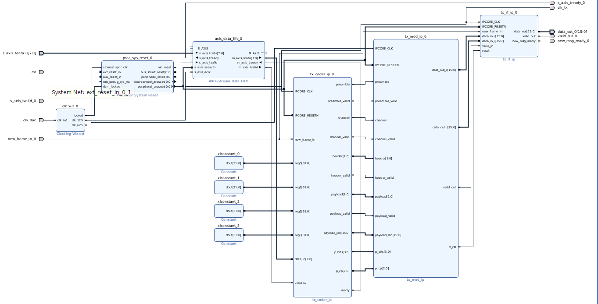
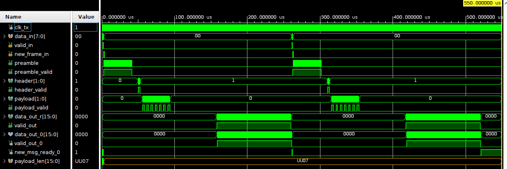
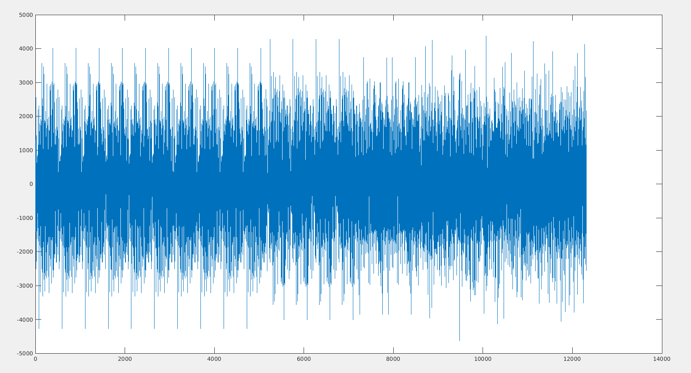
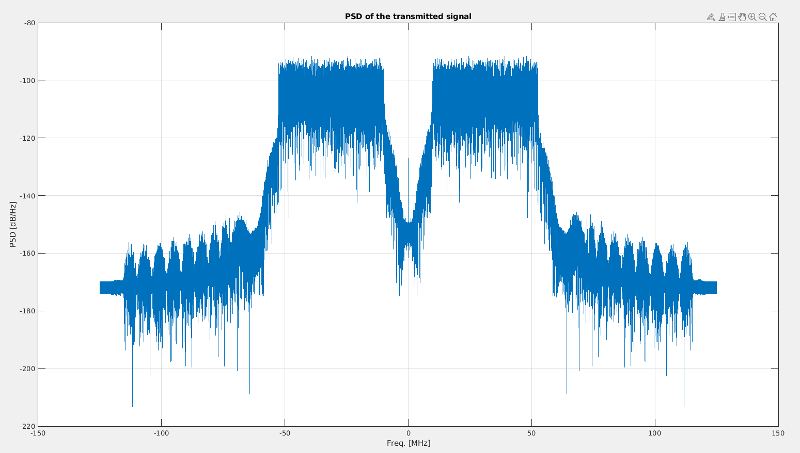
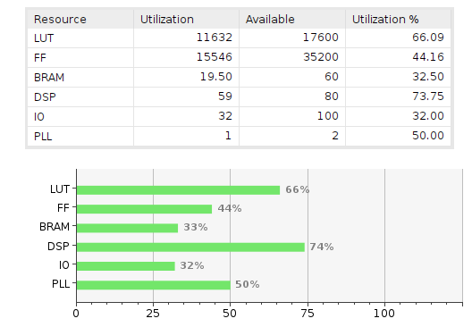
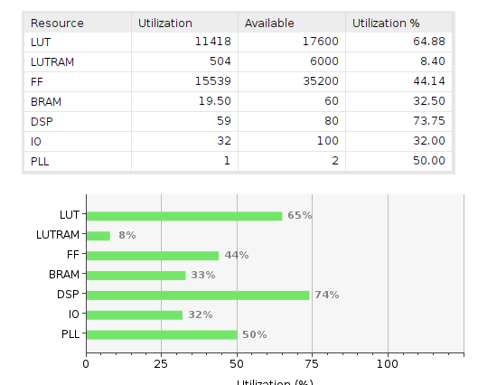
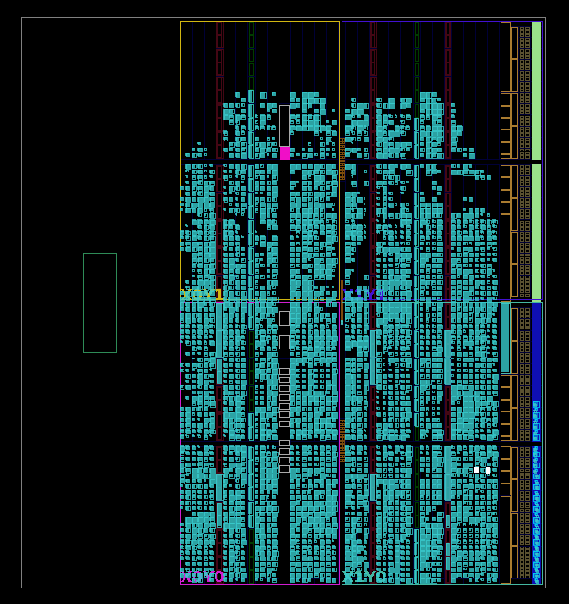

# Transmisor

Documento que indica todo lo necesario para usar el transmisor, compuesto por tres Ip Cores distintos:

* **tx_decoder_ip**:
* **tx_demod**:
* **tx_rf**:

El IP Core se encuentra en esta carpeta: [IP Core Tx](https://github.com/vlc-utn/dc-ofdm/tree/main/Docs/ip_cores).

El proyecto ejemplo de Vivado donde se corrió la simulación: [Ejemplo Tx](https://github.com/vlc-utn/dc-ofdm/tree/main/vivado/red_pitaya_tx).

## Funcionalidades probadas

* Máximo tamaño transmisible por trama: 4096 bytes.

* Mínimo tamaño transmisible por trama: 64 bytes.

* Acepta transmisión de múltiples tramas consecutivas, sin necesidad de reset. La señal de nuevo frame no debe recibirse mientras la señal de "new_msg_ready" esté en "0".

## Clocks

* **clk_dac**: [125 MHz]. Clock físico del DAC, conectado a la entrada del clocking wizard.

* **clk_125**: [125 MHz]. Clock del codificador y la etapa de RF.

* **clk_625**: [62.5 MHz]. Clock del modulador.

## Entradas

* **IPCORE_CLK**: [clk]. Señal de clock de 125 MHz.

* **IPCORE_RESETN**: [bool]. Señal de reset ACTIVE LOW ('0' para resetear).

* **new_frame_in**: [bool]. Indica que hay un nuevo mensaje a transmitir. Lee solamente el flanco ascendente de la señal.

* **[reg0, reg1, reg2, reg3]**: [uint32_t]. Registros de configuración.

* **data_in**: [uint8_t]. Datos a transmitir. Se espera que sean recibidos de una interfaz AXI4 Stream de 8bits.

* **valid_in**: [bool]. Momento en que los datos recibidos son válidos (señal de AXI4 Stream).

### Registros

Al recibir la señal "new_frame_in", se van a leer los registros de 32bits (reg0, reg1, reg2 y reg3) durante solamente un ciclo de clock, por lo que los registros pueden cambiar de valor durante la transmisión de un mensaje. Los registros quedan definidos como sigue:

| Register | 31 | 30 | 29     | 28     | 27     | 26      | 25      | 24      | 23  | 22  | 21  | 20  | 19  | 18   | 17   | 16   |
|----------|----|----|--------|--------|--------|---------|---------|---------|-----|-----|-----|-----|-----|------|------|------|
| reg0     | x  | x  | x      | x      | x      | x       | x       | x       | p23 | p22 | p21 | p20 | p19 | p18  | p17  | p16  |
| reg1     | x  | x  | x      | x      | x      | x       | x       | x       | x   | x   | x   | x   | x   | x    | x    | x    |
| reg2     | x  | x  | x      | x      | x      | concat2 | concat1 | concat0 | x   | x   | x   | x   | x   | rep2 | rep1 | rep0 |
| reg3     | x  | x  | mimon2 | mimon1 | mimon0 | mimos2  | mimos1  | mimos0  | x   | x   | x   | x   | x   | cp2  | cp1  | cp0  |

| Register | 15  | 14  | 13  | 12   | 11   | 10    | 9     | 8     | 7  | 6  | 5  | 4  | 3   | 2   | 1      | 0      |
|----------|-----|-----|-----|------|------|-------|-------|-------|----|----|----|----|-----|-----|--------|--------|
| 0x00     | p15 | p14 | p13 | p12  | p11  | p10   | p9    | p8    | p7 | p6 | p5 | p4 | p3  | p2  | p1     | p0     |
| 0x04     | m15 | m14 | m13 | m12  | m11  | m10   | m9    | m8    | m7 | m6 | m5 | m4 | m3  | m2  | m1     | m0     |
| 0x08     | x   | x   | x   | x    | x    | rate2 | rate1 | rate0 | x  | x  | x  | x  | x   | x   | block1 | block0 |
| 0x0c     | x   | x   | x   | bat4 | bat3 | bat2  | bat1  | bat0  | x  | x  | x  | x  | si3 | si2 | si1    | si0    |

* **p[23:0]**: *psduSize*. Tamaño en bytes del mensaje a transmitir.

* **m[15:0]**: *messageDuration*. En vez de usarse para indicar el tiempo que demora la transmisión, este parámetro se usa para indicar la cantidad de bytes "extra" agregados en la transmisión, para que sea múltiplo de "payloadBitsPerBlock0 = 21".

    Por ejemplo: si su mensaje es de 30 bytes, entonces (psduSize = 30; messageDuration = 9).

    Si su mensaje es de 300 bytes, entonces (psduSize = 300; messageDuration = 6).

    Si bien el mensaje "real" tiene un tamaño fijo, el mensaje escrito en la FIFO de entrada debe ser un múltiplo de 21 bytes, agregando bytes nulos para completar el múltiplo de 21.

* **block[1:0]**: *blockSize*. Siempre "00".

* **rate[2:0]**: *fecRate*. Siempre "001".

* **rep[2:0]**: *repetitionNumber*. Siempre "001".

* **concat[2:0]**: *fecConcatenationFactor*. Siempre "000".

* **si[3:0]**: *scramblerInitialization*. Cualquier valor (testeado con "1111").

* **bat[4:0]**: *batId*. Siempre "00010".

* **cp[2:0]**: *cyclicPrefixId*. Cualquier valor menos "000". (testeado con "001").

* **mimos[2:0]**: *explicitMimoPilotSymbolCombSpacing*. Cualquier valor (se puede usar para cualquier cosa).

* **mimon[2:0]**: *explicitMimoPilotSymbolNumber*. Cualquier valor (se puede usar para cualquier cosa).

## Outputs

* **data_out**: [int16]. Valores de salida, para el DAC. Los dos bits MSB no se usan, por lo que toma valores entre [-8192; 8191].

* **valid_out**: [bool]. Indica que el valor de salida es válido.

* **new_msg_ready**: [bool]. Indica que el bloque está preparado para recibir un nuevo mensaje. Esta salida responde al siguiente comportamiento:
  * Luego del reset, empieza en "1".
  * Al recibir en la entrada un `new_frame_in`, se pone en "0".
  * Cuando se termine de enviar el símbolo OFDM actual, se pone en "1" nuevamente, indicando que está listo para recibir un nuevo símbolo.

* **ready**: [bool]. Señal del AXI4-Stream. Indica que está listo para leer de la FIFO los datos del payload.

## Modo de uso

1. Escribir en la FIFO el mensaje a transmitir. Si bien el mensaje puede ser de "x" bytes (incluyendo 0 bytes), tenga en cuenta que lo que se escriba en la FIFO debe ser un múltiplo de 21 bytes (completar con '0' de ser necesario).

2. Setear los registros reg0, reg1, re2 y reg3.

3. Leer la señal `new_msg_ready`, y esperar hasta que esté en "1".

4. Levantar la señal `new_frame_in`. A partir de este punto, los registros pueden ser modificados sin problemas.

5. Esperar mientras se procesan el preámbulo y encabezado.

6. Se va a levantar la señal de `ready` y va a empezar a leer la FIFO la cantidad de bytes indicada por los registros.

7. Esperar mientras se forma el símbolo OFDM.

8. Se envía a la salida una señal continua de 125MHz lista para conectarse al DAC. Se indica su validez con la señal `valid_out`.

9. No se puede levantar otra señal de `new_frame_in` hasta que `new_msg_ready` valga '1'.

## Block Design

Todas las entradas y salidas externas a los bloques son de 125MHz. Las conexiones internas pueden usar el clock de 62.5MHz.

## Simulación

Critical warnings: 0.

La simulación fue realizada utilizando archivos adjuntos `data_in.mem` y `data_out.mem`, y con los siguientes valores de registros:

(Nota: el mensaje termina con caracteres de valor "0", no con espacios).

* msg = "This is an example message used to test the transmitter. It is made large on purpose to test for a large message being transmitted                 "
* reg0 = 147
* reg1 = 17
* reg2 = 65792
* reg3 = 66063

Esta simulación es el resultado de post-implementación

## Sintesis

Importante: agregar el archivo de constraints al proyecto de Vivado, de nombre`ieee_constraints.xdc`.

Critical warnings: 0.

## Implementacion

Critical warnings: 2 (relacionadas con no haber definido la ubicación física de los pines).

Warnings: 4. Una dice que n se uso el ZYNQ. Y 3 hacen referencia a DSPs inferidos, que se sugieren que tengan al menos dos registros a la salida (lo cual todos los multiplicadores cumplen).

## Historial de versiones

### v7.0

* Recompilar el transmisor en tres bloques separados.

### v6.0

* Ahora todas las entradas y salidas del bloque transmisor son de 125MHz. Se elimina la necesidad de usar un clock externo de 15.625MHz.
* Se modifica el archivo de constraints para agregar a Multy Cycle Path constraints la FIFO de entrada del payload.

### v5.0

* Se divide a la mitad el valor de salida (anteriormente, había un logical shift izquierdo, que ahora se eliminó para evitar que el ringing de salida sature el DAC).

* Se agrega una FIFO a la entrada del payload, para evitar problemas de sincronización.

### v4.0

* Ahora la simulación RTL y la simulación post implementación coinciden. Se modificó la lógica de bloques con "enable", y se hicieron los subsistemas sincrónicos.

* Se reduce el ancho de banda máximo de la señal y se hace el filtro de interpolación más fino.

### v3.0

* Ahora solamente se lee el flanco ascendente de la señal `new_frame_in`.
* La salida es ahora un int16, que toma valores entre [-8192; 8191].
* Se agrega la nueva salida `new_msg_ready`, para sincronizar la recepción de nuevos símbolos desde el software.

### v2.0

* Se elimina la señal "Tlast" a la entrada del Ip Core.
* La salida ahora es de 16 bits, con los dos bits LSB ignorados.

### v1.2

Se agrega mención al archivo de constraints.

### v1.1

Se agrega especificación del tamaño de "120 bytes" múltiplo del mensaje.

### v1.0

Creación inicial del documento
