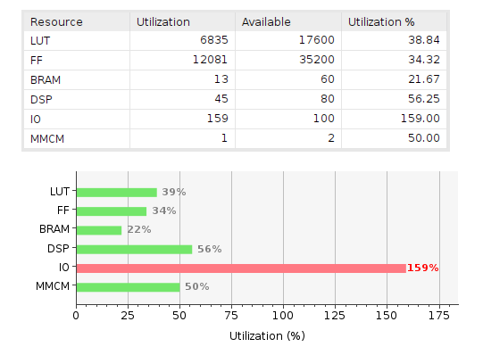
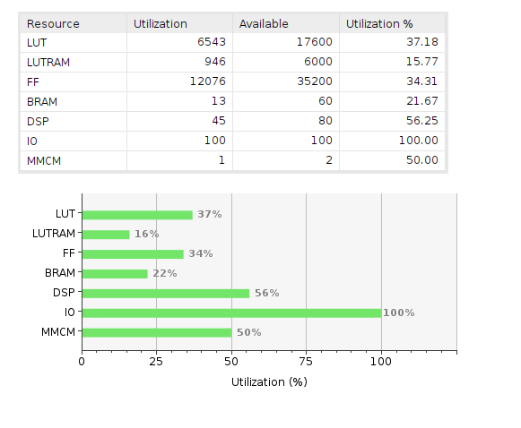
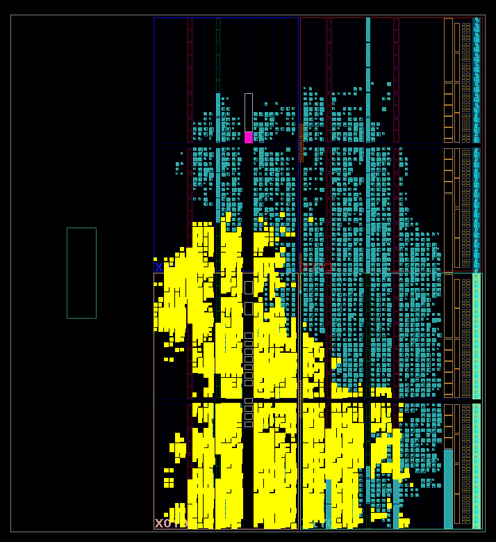

# Optimización de Full TX

Bueno, ya habiendo optimizado los componentes del transmisor por separado, toca ver como compila el transmisor sin y con optimizaciones en la FPGA.

Primero, sin optimizar:

## Full Tx Raw (sin optimizar)

Lo que espero ver es que la versión sin optimizar tenga el mismo timing que las otras (pues no cambiaba mucho), pero que el clock pipelining permita que el resource sharing baje la utilización de recursos.

Estos son los resultados del reporte de síntesis del transmisor sin optimizar:

A pesar de que los bloques individuales cumplían con el timing, el bloque con todo junto no cumple con el timing. Según el reporte, hay un solo camino que no cumple con el timing:

El camino que va: `full_tx_raw_i/full_tx_raw_0/U0/u_full_tx_raw_dut_inst/u_full_tx_raw_src_full_tx/u_full_ofdm_modulator/u_ofdm_modulator/u_OFDM_Modulator/obj_numLgScReg_reg[0]/C` -> `full_tx_raw_i/full_tx_raw_0/U0/u_full_tx_raw_dut_inst/u_full_tx_raw_src_full_tx/u_full_ofdm_modulator/u_ofdm_modulator/u_OFDM_Modulator/obj_triggerReady_2_reg/D`

La palabra clave es "OFDM_modulator" y "numLgScReg". Esto se debe muy probablemente a que hay mucha concentración de bits (fan-out) en esta zona, lo que hace que el timing no de.

Según Vivado, este registro tiene 4.4 segundo de "net" delay, es decir, delay por ruteo.

Ya que estamos, también corro la implementación, para ver si el timing mejora o empeora. Estos son los resultados luego de correr la implementación:

La utilización bajo un poquito (39% LUT vs 37% LUT).

El timing de setup de hecho mejoro un poquito, pero sigue sin cumplir.

El problema de timing está marcado en el "Delay 7", que se corresponde con el delay a la entrada de la señal "valid_in" del modulador OFDM.

En amarillo, todos los recursos asignados al modulador de OFDM.

## Reduciendo cantidad de bits en OFDM modulator

Viendo que no da el timing, reduzco la cantidad de bits para reducir el fanout y la densidad de ruteo en la zona (ver el README del Tx Modulator, donde se hacen estas pruebas).
